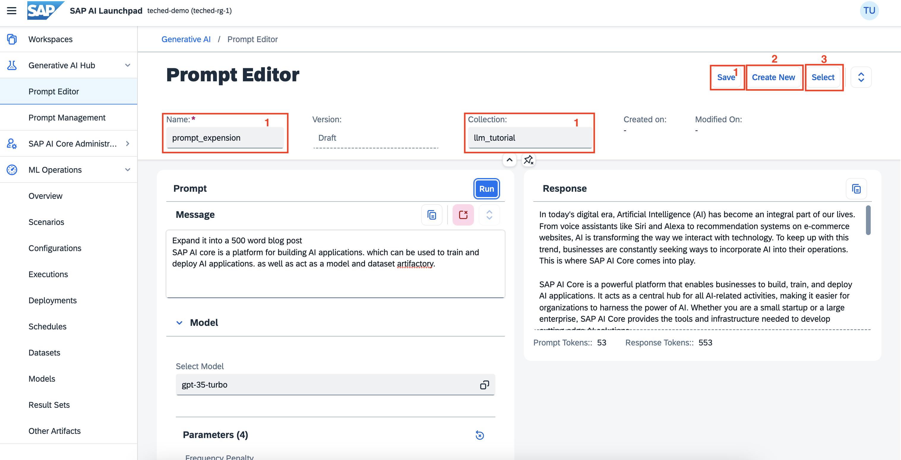
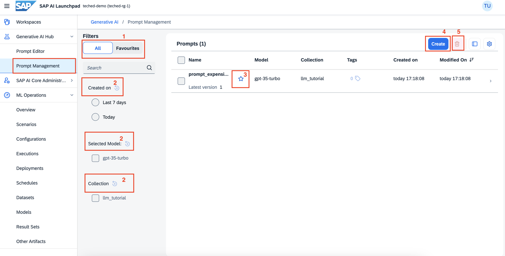

# Prompt Engineering

Understand the principles of prompt engineering and learn to create effective prompts for AI models like ChatGPT. Prompt engineering is crucial for obtaining desired outputs from AI models. It helps in guiding the model's response in a particular direction.
You will learn
How to deploy an LLM model.
How to use the model to execute different queries.

## Prerequisites
- You have an SAP AI Launchpad service instance and service key. For more information, see [SAP AI Core Initial Setup Documentation](http://help.sap.com/docs/sap-ai-core/sap-ai-core-service-guide/initial-setup).
- You’re using the sap-internal service plan.
- Your SAP AI Launchpad is connected to the SAP AI Core runtime. For more information, see [Add a Connection to SAP AI Core in SAP AI Launchpad Documentation](http://help.sap.com/docs/ai-launchpad/sap-ai-launchpad/add-connection-to-sap-ai-core)
- You have the **genai_text** role collection.

# Introduction:

## AICORE:

SAP AI Core is a service designed to handle the execution and operations of your AI assets in a standardized, scalable, and hyperscaler-agnostic way. SAP AI Core supports full lifecycle management of your AI scenarios.

## AI Launchpad

SAP AI Launchpad is a multitenant software as a service (SaaS) application in SAP Business Technology Platform which is used to manage AI use cases (scenarios) across multiple instances of AI runtimes. AICORE is one such runtime.

## Deploying LLM models
You can make LLMs available for use by creating an LLM deployment. You can do so once for each model and model version.

 - Check whether the foundation-models scenario is present in your workspace

<left></left>

- Creating a configuration

<left></left>

- Give a name for the configuration,
- select the foundation-models scenario.
- Choose the version and select azure-openai executable.


<left></left>

In input parameters, give name and version of the model you want to use.

<left></left>

These are the models available as of now:

<left></left>

Click next -> review -> create.


## Creating a deployment
Once you created the configuration, click on create deployment.

<left></left>

Set duration as standard and click review.

<left></left>

Once you create the deployment, wait for the current status to be set to RUNNING.

<left></left>

Once the deployment is running, go to Generative AI -> Prompt Editor

<left></left>

In Selected Model, you can see all the models that are deployed. Select the model that you want to use. Gpt-35-turbo will be selected as a default model.

<left></left>

Now, you can prompt your queries and generate responses.

## Querying the LLMs
Give your prompt in the prompt field, and click on Run to get your output.

We can set the following parameters here -

**Max-Tokens**: The maximum number of tokens allowed for the generated answer.

**Temperature**: What sampling temperature to use, between 0 and 2. Higher values will make the output more random, while lower values will make it more focused and deterministic.

**Presence Penalty**: Introduces random sampling for generated tokens by randomly selecting the next token from the k most likely options. Set to 0.0 if repeatable output is desired.

**Frequency Penalty**: Introduces random sampling for generated tokens by randomly selecting the next token from the smallest possible set of tokens whose cumulative probability exceeds the probability top_p. Set to 0.0 if repeatable output is desired.

Here in this demo we are going to try out show text expansion qualities of AI core, where we wrote a few sentences about AI core and asked the LLM model to write a 500 word blog post or paragraph based on the context it understands.

```
Expand it into a 500 word blog post
SAP AI core is a platform for building AI applications. which can be used to train and deploy AI applications. as well as act as a model and dataset artifactory.

```


<left></left>
1. Once happy with reponse we can save the prompt using save button with the given name and collection.
2. Using create New we can create new prompt.
3. Using select option we can select already saved prompt.

<left></left>

Next lets see how we can manage the already saved prompts from prompt management page.
Goto-> prompt management from side menu.

<left></left>

1. Filter the prompts
2. Search and filter using - date, model, collection
3. Mark/Unmark as Favourites 
4. Create new prompt
5. Delete selected prompt


