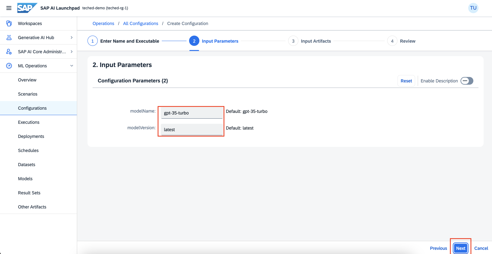

# Prompt Engineering

Understand the principles of prompt engineering and learn to create effective prompts for AI models like ChatGPT. Prompt engineering is crucial for obtaining desired outputs from AI models. It helps in guiding the model's response in a particular direction.
You will learn
How to deploy an LLM model.
How to use the model to execute different queries.

## Prerequisites
- You have an SAP AI Launchpad service instance and service key. For more information, see [SAP AI Core Initial Setup Documentation](http://help.sap.com/docs/sap-ai-core/sap-ai-core-service-guide/initial-setup).
- You’re using the sap-internal service plan.
- Your SAP AI Launchpad is connected to the SAP AI Core runtime. For more information, see [Add a Connection to SAP AI Core in SAP AI Launchpad Documentation](http://help.sap.com/docs/ai-launchpad/sap-ai-launchpad/add-connection-to-sap-ai-core)
- You have the **genai_text** role collection.

# Introduction:

## AICORE:

SAP AI Core is a service designed to handle the execution and operations of your AI assets in a standardized, scalable, and hyperscaler-agnostic way. SAP AI Core supports full lifecycle management of your AI scenarios.

## AI Launchpad

SAP AI Launchpad is a multitenant software as a service (SaaS) application in SAP Business Technology Platform which is used to manage AI use cases (scenarios) across multiple instances of AI runtimes. AICORE is one such runtime.

## Deploying LLM models
You can make LLMs available for use by creating an LLM deployment. You can do so once for each model and model version.

 - Check whether the foundation-models scenario is present in your workspace

<left></left>

- Creating a configuration

<left></left>

- Give a name for the configuration,
- select the foundation-models scenario.
- Choose the version and select azure-openai executable.

<left></left>

In input parameters, give name and version of the model you want to use.

<left></left>

These are the models available as of now:

<left></left>

Click next -> review -> create.

