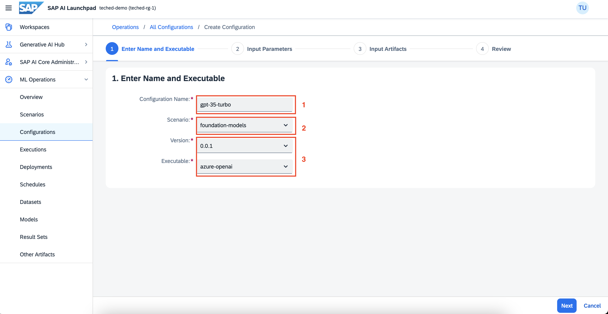
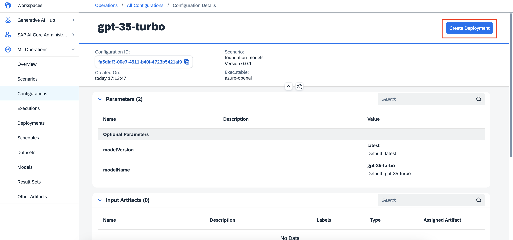
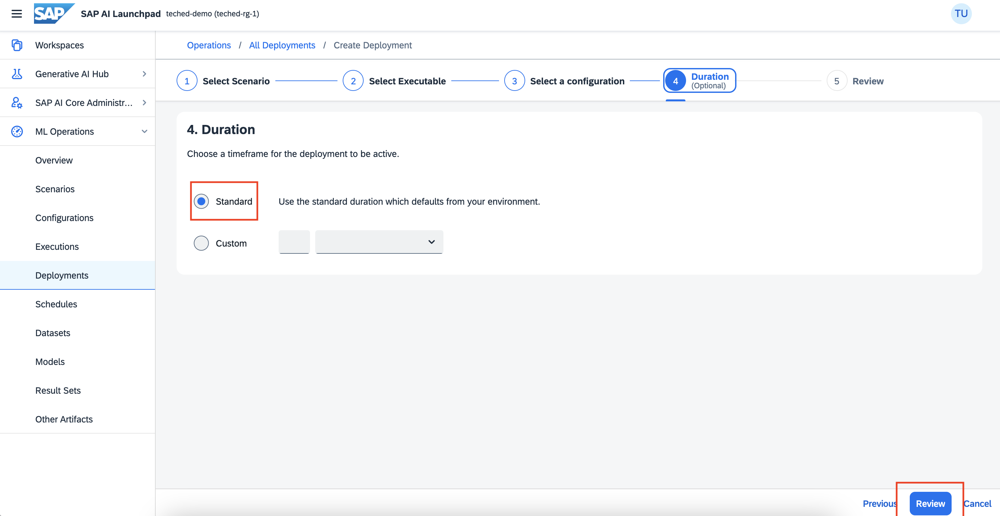
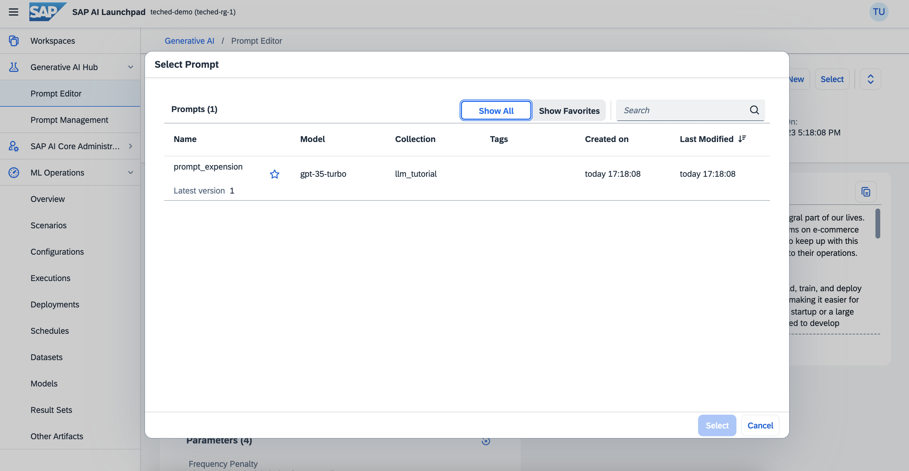

# Prompt Engineering

Enhance your understanding of prompt engineering and master the art of creating highly effective prompts for AI models. Prompt engineering plays a pivotal role in achieving desired outputs from AI models by effectively guiding their responses towards a specific direction. In this exercises, you will gain valuable insights on deploying an LLM model and learn how to utilize it to execute various queries with utmost precision and accuracy.


## Introduction:

### AICORE:

SAP AI Core is a service designed to handle the execution and operations of your AI assets in a standardized, scalable, and hyperscaler-agnostic way. SAP AI Core supports full lifecycle management of your AI scenarios.

### AI Launchpad

SAP AI Launchpad is a multitenant software as a service (SaaS) application in SAP Business Technology Platform which is used to manage AI use cases (scenarios) across multiple instances of AI runtimes. AICORE is one such runtime.

## Hands on steps
AI Launchpad URL - https://aif-int-eu-central-1-aws.ai-launchpad.int.eu-central-1.aif-dev.com 

To access the app, simply click on the link provided above. You will be automatically logged in. In case you are prompted for credentials, please use the username and password details stored in the system you are using to access this hands-on guide. You can find these details in the Home folder under technical-users.

For this workshop, a connection to aicore has already been established through AI Launchpad. To proceed, choose the existing connection named **llm-access** and select the **default** resource group.

<left></left>

After selecting the resourceGroup, you will be able to see the  **mloperations** application in the side navigation.

### 1. Deploying LLM models
To make LLMs accessible, you can create an LLM deployment for each model and its version.

 - Check whether the foundation-models scenario is present in your workspace

<left></left>

- Creating a configuration

<left></left>

- Give a name for the configuration,
- select the foundation-models scenario.
- Choose the version and select azure-openai executable.


<left></left>

In input parameters, give name and version of the model you want to use.

<left></left>

These are the models available as of now:
| 	Executable Id	 | 	Model Name	 | 	Version	 | 
| 	:-----:	       | 	:-----:	    | 	:-----:	 | 
| 	azure-openai	  | 	gpt-35-turbo| 	0613	    | 
| 	azure-openai	  | 	gpt-35-turbo-16k| 	0613	    | 
| 	azure-openai	  | 	gpt-4       | 	0613	    | 
| 	azure-openai	  | 	gpt-4-32k      | 	0613	    | 
| 	aicore-opensource	  | 	tiiuae--falcon-40b-instruct      | 	null	    | 
 

Click next -> review -> create.


### 2. Creating a deployment
Once you created the configuration, click on create deployment.

<left></left>

Set duration as standard and click review.

<left></left>

After creating the deployment, please wait until the current status is set to RUNNING.

<left></left>

To access the Prompt Editor, navigate to Generative AI once the deployment is up and running.

<left></left>

In the Selected Model section, you can find a comprehensive list of all the deployed models. Simply choose the model that suits your needs. By default, the gpt-35-turbo model will be pre-selected for you.

<left></left>

Now, you can prompt your queries and generate responses.

### 3. Querying the LLMs
Give your prompt in the prompt field, and click on Run to get your output.

We can set the following parameters here -

**Max-Tokens**: The maximum number of tokens allowed for the generated answer.

**Temperature**: What sampling temperature to use, between 0 and 2. Higher values will make the output more random, while lower values will make it more focused and deterministic.

**Presence Penalty**: Fine-tune the models behaviour regarding the verbosity of responses

**Frequency Penalty**: Fine-tune the models behaviour regarding the repetation of responses.


Here in this demo we are going to try out show text expansion qualities of AI core, where we wrote a few sentences about AI core and asked the LLM model to write a 500 word blog post or paragraph based on the context it understands.

```
Expand it into a 500 word blog post
SAP AI core is a platform for building AI applications. which can be used to train and deploy AI applications. as well as act as a model and dataset artifactory.

```


<left></left>
1. To save the prompt, simply click on the save button and provide a name and collection for easy reference in the future.
2. By utilizing the "Create New" feature, we can easily generate new prompts.
3. By utilizing the select option, we can conveniently choose from a list of previously saved prompts.

<left></left>

Next, let's explore how we can effectively manage the prompts that have already been saved on the prompt management page. To do this, navigate to the Generative AI Hub and select the prompt management option from the side menu.

<left></left>

1. Filter the prompts
2. Search and filtering options, including date, model, and collection
3. Allow users to mark/unmark prompts as favorites for easy access
4. Enable users to create new prompts easily
5. Provide the option to delete selected prompts for better organization


Now that you have had the opportunity to explore the prompt engineering feature of AI Launchpad, let's delve into some exciting prompt techniques that you can experiment with.

### _Disclaimer:_

_Please be aware that the application you are currently using is still under active development. As a result, it is possible that you may encounter certain issues or experience limitations during your workshop or usage of the system._

## Text Summarization
This example tasks the LLM with condensing and summarizing a given text. The text, clearly demarcated with triple backticks, is expected to be distilled into a concise summary of no more than 30 words. The focus is on extracting the most salient points and presenting them in a succinct manner, ensuring that the essence of the original content is retained without excessive verbosity. This format is designed to challenge the LLM’s capability to discern key details and convey them efficiently. For this demo we have taken 2 pages from SAP annual report 2 on Independent Assurance Practitioner’s Report by KPMG.

```
Your task is to generate a short summary of a text.
Summarize the text below, delimited by triple backticks, in at most 30 words. 

Review: ```Independent Assurance Practitioner's Report
To the Supervisory Board of SAP SE, Walldorf
We have performed a limited assurance engagement on the non-financial statement of SAP SE (further “Company” or “SAP”) and on the non-financial statement of the parent company that is combined with it, which are published in the Management Report, (further “combined non-financial statement”) for the period from January 1 to December 31, 2022.
Responsibilities of Management
Management of the company is responsible for the preparation of the combined non-financial statement in accordance with Sections 315c in conjunction with 289c to 289e HGB [“Handelsgesetzbuch”: German Commercial Code] and Article 8 of REGULATION (EU) 2020/852 OF THE EUROPEAN PARLIAMENT AND OF THE COUNCIL of June 18, 2020 on establishing a framework to facilitate sustainable investment and amending Regulation (EU) 2019/2088 (hereinafter the "EU Taxonomy Regulation") and the Delegated Acts adopted thereunder, as well as for making their own interpretation of the wording and terms contained in the EU Taxonomy Regulation and the delegated acts adopted thereunder as set out in section “Sustainable Finance: EU Taxonomy Disclosures” of the combined non-financial statement.
This responsibility includes the selection and application of appropriate non-financial reporting methods and making assumptions and estimates about individual non-financial disclosures of the group that are reasonable in the circumstances. Furthermore, management is responsible for such internal control as they consider necessary to enable the preparation of a combined non-financial statement that is free from material misstatement, whether due to fraud or error.
The EU Taxonomy Regulation and the Delegated Acts issued thereunder contain wording and terms that are still subject to considerable interpretation uncertainties and for which clarifications have not yet been published in every case. Therefore, management has disclosed their interpretation of the EU Taxonomy Regulation and the Delegated Acts adopted thereunder in section “Sustainable Finance: EU Taxonomy Disclosures” of the combined non-financial statement. They are responsible for the defensibility of this interpretation. Due to the immanent risk that indeterminate legal terms may be interpreted differently, the legal conformity of the interpretation is subject to uncertainties.
Independence and Quality Assurance of the Assurance Practitioner’s firm
We have complied with the independence and quality assurance requirements set out in the national legal provisions and professional pronouncements, in particular the Professional Code for German Public Auditors and Chartered Accountants (in Germany) and the quality assurance standard of the German Institute of Public Auditors (Institut der Wirtschaftsprüfer, IDW) regarding quality assurance requirements in audit practice (IDW QS 1).
Responsibility of the Assurance Practitioner
Our responsibility is to express a conclusion with limited assurance on the combined non-financial statement based on our assurance engagement.
We conducted our assurance engagement in accordance with International Standard on Assurance Engagements (ISAE) 3000 (Revised): "Assurance Engagements other than Audits or Reviews of
41/335
  SAP Integrated Report 2022
 To Our Stakeholders
    Combined Group Consolidated Financial Further Information on Management Report Statements IFRS Sustainability
  Additional Information
  Historical Financial Information" issued by the IAASB. This standard requires that we plan and perform the assurance engagement to obtain limited assurance about whether any matters have come to our attention that cause us to believe that the company's non-financial statement, is not prepared, in all material respects, in accordance with Sections 315c in conjunction with 289c to 289e HGB and the EU Taxonomy Regulation and the Delegated Acts issued thereunder as well as the interpretation by management disclosed in section “Sustainable Finance: EU Taxonomy Disclosures” of the combined non-financial statement. We do not, however, issue a separate conclusion for each disclosure.
In a limited assurance engagement, the procedures performed are less extensive than in a reasonable assurance engagement, and accordingly, a substantially lower level of assurance is obtained. The selection of the assurance procedures is subject to the professional judgment of the assurance practitioner.
In the course of our assurance engagement we have, among other things, performed the following assurance procedures and other activities:
– Interviewing employees responsible for the materiality analysis at group level in order to obtain an understanding on the approach for identifying key issues and related reporting limits of SAP,
– Carrying out a risk assessment, inclusive of media analysis, on relevant information on sustainability performance of SAP in the reporting period,
– Assessing the design and implementation of systems and processes for identifying, handling, and monitoring information on environmental, employee and social matters, human rights and combating corruption and bribery, including the consolidation of data,
– Interviewing staff on group level, who are responsible for the disclosures on concepts, due diligence processes, results and risks, the performance of internal control activities and the consolidation of the disclosures,
– Inspecting selected internal and external documents,
– Analytically assessing the data and trends of the quantitative information, which is reported on group level of all locations,
– Evaluating the local data collection, validation, and reporting processes as well as the reliability of the reported data by means of a sampling survey at two locations,
– Interviewing of responsible staff on group level to obtain an understanding of the approach to identify relevant economic activities in accordance with the EU taxonomy,
– Evaluating the design and implementation of systems and procedures for identifying, processing, and monitoring information on turnover, capital expenditures and operating expenditures for the taxonomy-relevant economic activities for the first two environmental objectives climate change mitigation and climate change adaptation,
– Evaluating the data collection, validation, and reporting processes, as well as the reliability of the reported data for the taxonomy-aligned economic activities in conjunction with the assessment of the technical evaluation criteria for the substantial contribution, the fulfilment of the DNSH-criteria and the documentation of the minimum safeguard,
– Assessment of the overall presentation of the disclosures.
In determining the disclosures in accordance with Article 8 of the EU Taxonomy Regulation, management is required to interpret undefined legal terms. Due to the immanent risk that undefined legal terms may be interpreted differently, the legal conformity of their interpretation and, accordingly, our assurance engagement thereon are subject to uncertainties.
Assurance Opinion
Based on the assurance procedures performed and the evidence obtained, nothing has come to our attention that causes us to believe that the combined non-financial statement of SAP SE, Walldorf for
42/335

 SAP Integrated Report 2022
To Our Stakeholders
Combined Group Consolidated Financial Further Information on Management Report Statements IFRS Sustainability
Additional Information
the period from January 1 to December 31, 2022 has not been prepared, in all material respects, in accordance with Sections 315c in conjunction with 289c to 289e HGB and the EU Taxonomy Regulation and the Delegated Acts issued thereunder as well as the interpretation by management as disclosed in section “Sustainable Finance: EU Taxonomy Disclosures” of the combined non-financial statement.
Restriction of Use
This assurance report is solely addressed to SAP SE, Walldorf.
Our assignment for SAP SE, Walldorf and professional liability is governed by the General Engagement Terms for Wirtschaftsprüfer (German Public Auditors) and Wirtschaftsprüfungs- gesellschaften (German Public Audit Firms) (Allgemeine Auftragsbedingungen für Wirtschaftsprüfer und Wirtschaftsprüfungsgesellschaften) in the version dated January 1, 2017 (https://www.kpmg.de/bescheinigungen/lib/aab_english.pdf). By reading and using the information contained in this assurance report, each recipient confirms having taken note of provisions of the General Engagement Terms (including the limitation of our liability for negligence to EUR 4 million as stipulated in No. 9) and accepts the validity of the attached General Engagement Terms with respect to us.
Mannheim, den 22. Februar 2023
KPMG AG Wirtschaftsprüfungsgesellschaft
Beyer
Wirtschaftsprüfer [German Public Auditor]
Wiegand Wirtschaftsprüfer [German Public Auditor]```

```

## Question Answering
This example instructs the LLM to formulate a concise response to a specific question, with the context provided for reference. The LLM’s answer should be encapsulated within triple backticks, ensuring a clear distinction between the question and the response. If the LLM is uncertain about the correct answer based on the provided context, it is instructed to reply with “Unsure about answer”, offering a clear acknowledgment of uncertainty rather than providing potentially inaccurate information. Where we took a part of memo by Christian Klein from SAP Annual report.

```
Answer the question, delimited by triple backticks based on the context below. Keep the answer short and concise. 
Respond "Unsure about answer" if not sure about the answer.
Context: Dear Fellow Shareholders,
It’s hard to summarize the year 2022 in a few words – as the pandemic continued, the world also faced new and unexpected challenges, such as the terrible war in Ukraine, that hugely impacted all of our lives. We have faced conflicts and geopolitical tensions, climate change, the energy crisis, inflation, and volatile markets. Yet, once again, we have seen solidarity in times of crisis – people coming together to provide support to those in need when it mattered most. Despite the ongoing uncertainties in the world, SAP has remained in a strong position.
2022 marked the 50th anniversary of SAP, which we celebrated together with our customers, partners, and colleagues across the world. Five decades ago, our founders set out to redefine business software and in doing so, forever changed the way the world runs. Their innovative thinking, pioneering spirit, and drive laid the foundation for the rise of SAP – and they are still the basis for our success today, as we are carrying their legacy forward to drive positive change for our planet and its people – something that has never been more relevant or important than today.
Our hearts remain with the people impacted by the war in Ukraine. As announced, SAP has stopped all sales in Russia and Belarus, and we are in the process of a total withdrawal from these markets. For 2023, while business wind-down continues, our focus is on further reducing the remaining SAP footprint in Russia. We hope for the swift restoration of peace and will continue to help those affected by this war.
7/335
  SAP Integrated Report 2022
 To Our Stakeholders
    Combined Group Consolidated Financial Further Information on Management Report Statements IFRS Sustainability
  Additional Information
  The last year was a stark reminder that no one business, government, or society can tackle the greatest challenges of our time alone. For that, a change is needed, and technology plays a key role in finding solutions to our global challenges.
Over two years ago, we embarked on our transformation journey to move SAP towards a cloud company. This, together with our vision to enable every organization and every industry to become a network of intelligent, sustainable enterprises, is perfectly aligned with the challenges our customers face. From increasing speed and agility, building transparent and resilient supply chains, and recording, reporting, and acting on sustainability, our solutions provide the value our customers need:
– With RISE with SAP, we enable organizations to become agile, intelligent enterprises.
– With the SAP Business Network, we connect millions of companies, allowing organizations to
benefit from connected networks.
– With our SAP sustainability solutions, we enable organizations to truly operate sustainably.
Looking at our financial numbers, we met all of our outlook metrics in 2022. Our strong full-year 2022 results at a glance:
– Cloud revenue continued to be our main growth driver, increasing by 24%1.
– Current cloud backlog increased by 24%1.
– Total revenue grew 5%1.
– IFRS Operating profit was flat, while non-IFRS operating profit decreased by 7%1.
– Free cash flow was €4.35 billion.
2022 was a volatile year on the market, with technology stocks particularly hard hit. Our shares were not immune from this overall trend. Our share price decreased 22.8% in 2022, below the DAX, which lost 12.4%, but better than the NASDAQ 100, which decreased 33% over the course of the year. We want our shareholders to participate in our success. Therefore, we have proposed an annual dividend of €2.05 per share2,  an increase of approximately 5% over the prior year’s regular dividend.
Customer Net Promoter Score (NPS) decreased 7 points year over year to 3 in 2022, hitting the lower end of the revised outlook range. SAP’s Employee Engagement Index decreased 3 percentage points to 80%, a continued high level of engagement at the low end of the revised outlook range. The software as a service-industry scores overall have declined over the past few years of the pandemic. SAP continues to get feedback about needed improvements around pricing increases, licensing structure, product-related topics, support, service and stability of account team relationships. This type of transparent feedback and accountability helps provide us with the information to better focus investments and further improve our customer relationships. SAP’s retention rate was 92.3% (2021: 92.8%). Further, the proportion of women in management increased to 29.4% (2021: 28.3%) and we also reached 35% of women in the workforce. Net carbon emissions continued to decrease, at 85 kilotons in 2022, down 25 kt year over year.
In addition to driving our ESG goals internally, we also take our wider social and environmental responsibility very seriously:
– In total, SAP donated more than €4.2 million to support Ukraine in cooperation with organizations such as UNICEF, UNHCR, and the German Red Cross. This includes our employee donation campaign which became SAP’s largest employee donation campaign to date.
– SAP extended its partnership with UNICEF through Generation Unlimited (GenU), focusing on employability. The partnership also supports SAP Educate to Employ, a new program educating
1 At constant currencies
2 Pending approval of Annual General Meeting of Shareholders
 8/335

  SAP Integrated Report 2022
 To Our Stakeholders
    Combined Group Consolidated Financial Further Information on Management Report Statements IFRS Sustainability
  Additional Information
  youth in need on soft skills, foundational knowledge, and SAP skills to enable a pathway to a successful career in the SAP ecosystem.
– Together with partners, we launched the TRANSFORM Support Hub offering virtual pro bono consulting opportunities worldwide, connecting SAP employees to social enterprises.
Net-net: We believe that together with our customers, colleagues, and partners around the world, we can turn the world’s greatest challenges into opportunities for a prosperous and greener future. 2022 was one of the most important years in our history. As we head into 2023, we are committed to further optimizing and improving our business. We are deepening our focus on delivering lifetime value to current and new customers in the cloud and on high-growth opportunities where SAP can lead. Across SAP, we are laying the foundation for SAP’s ongoing success, expanding our position as the #1 Enterprise Application company on the planet, powered by our leading platform. 
Finally, I want to express my deepest thanks for your continuous trust in SAP. I certainly look back on 2022 with pride and gratitude for the many ways SAP’s teams around the world are making a difference. I’m very much looking forward to 2023, and the great achievements our over 100,000 colleagues will continue to deliver as we pursue our vision to enable every organization and every industry to become a network of intelligent, sustainable enterprises.
Sincerely,
Christian Klein CEO, SAP SE
9/335

  
 SAP Integrated Report 2022
To Our Stakeholders
Combined Group Consolidated Financial Further Information on Management Report Statements IFRS Sustainability
Additional Information
SAP Executive Board
Question: ```How is SAP performing?```

```

## Text Classification - Sentiment Analysis
This example directs an LLM to perform sentiment analysis on a provided product review. The LLM is instructed to assess the sentiment of the review text and respond with a single word, either “positive” or “negative”. The review text is clearly delineated using triple backticks, ensuring clarity about which portion of the text needs to be analyzed. This format aims to extract concise and direct sentiment evaluations without any ambiguity.

```
What is the sentiment of the following product review, 
which is delimited with triple backticks?

Give your answer as a single word, either "positive" or "negative".

Review text: '''SAP has Best work Environment and Best ERP product'''

```

## Translation
An example is constructed to ask the LLM to detect the language of the message. The message is enclosed within triple backticks for clarity.

```
Tell me what language this is: Here is a demo on Large language Models
```

Another example is formulated to instruct the LLM to translate the given message to both Malayalam and German

```
Translate the following  text to Malayalam and german: Here is a demo on Large language Models

```
## Expansion
Here in this demo we are going to try out show text expansion qualities of AI core, where we wrote a few sentences about AI core and asked the LLM model to write a 500 word blog post or paragraph based on the context it understands.

```
Expand it into a 500 word blog post
SAP AI core is a platform for building AI applications. which can be used to train and deploy AI applications. as well as act as a model and dataset artifactory.

```

## Tone adjustment
Here in tone Adjustment we are trying to showcase use the LLM’s capabilities to change/modify the tone of a text written by a new joinee at SAP to proper professional tone.

```
Translate the following input to a Corporate language
Sap Blue a new product from SAP. that is a gig based product. launched in 2016 relaunched in 2023.

```
## Spell-check / Grammar-check

Here we picked a paragraph from wikipedia on SAP and made a few spelling and grammatical errors. Now we will be asking the LLM to fix those errors by proofreading the content.

```
proofread and correct this review: ```SAP SE is a German multinationl software company based in Walldorf, Baden-Württemberg. It develops enterprise software to manage business operations and customer relations. The company is the world leading enterprise resource planing software vendor.```

```

## Doing multiple tasks at once
We picked up a random review from trust pilot on SAP ERP and want the LLM to perform multiple tasks at once which include sentiment analysis, checking if the user is angry with the product, which product/item they are talking about and which brand does it belong to.

```
Identify the following items from the review text: 
- Sentiment (positive or negative)
- Is the reviewer expressing anger? (true or false)
- Item purchased by reviewer
- Company that made the item

The review is delimited with triple backticks.
Format your response as a JSON object with "Sentiment", "Anger", "Item" and "Brand" as the keys.
If the information isn't present, use "unknown" as the value.
Make your response as short as possible. Format the Anger value as a boolean.

Review text: '''A true ERP software available in the market which captures 60% of market share and known as a ERP leader. The best part about the product that it can be used cloud based and it can be integrated with several modules which are equally relevant as a department. I have been a part of SAP from past 12+ years and I am extremely happy of using and referring this product to others as well. This isn't only beneficial for companies but can also make careers for humans as well. Now a days cloud based functionality and integration with API tools are the best part in it. Easy to customize according to the requirement of a client. It has several features and capabilities 1. Cost efficient, 2. Advance data management, 3. Saves time, 4. Increase productivity, 5. Real time data saving to server's, 6. Avoid duplication and ensures transparency. Best product available in the market.'''

```

## Few-Shot Prompting
The following example demonstrates a few-shot learning approach in prompt engineering, where the model is provided with a couple of examples to understand the desired task and format. Instead of explicitly stating the task, the LLM is given a context in which it should operate.

Contextual Setup: The “Child” and “Grandparent” dialog sets up a context. The model is implicitly being taught that it should generate responses in the style of a wise grandparent answering a child’s questions.
Example Provided: The first complete interaction (about patience) serves as a shot or example, guiding the model on how it should structure its response.
Task Indication: The second interaction (about unity) is incomplete, indicating the task the model needs to perform. The goal is to get the model to continue the pattern and provide a similarly styled, profound answer to the child’s new question.
The model’s generated completion is then printed, providing insight into its understanding and continuation of the provided examples.

In summary, by using a few-shot learning approach, the model is guided to understand and emulate the style of the conversation without explicitly being told the exact format or context. This method leverages the model’s ability to generalize from few examples and produce consistent and contextually relevant outputs.
```
Your task is to answer in a consistent style.

Child: Teach me about patience.

Grandparent: The river that carves the deepest 
valley flows from a modest spring;
the grandest symphony originates from a single note; 
the most intricate tapestry begins with a solitary thread.

Child: Teach me about unity.

Grandparent:

```
## Zero-Shot prompting
The following example showcases an advanced application of prompt engineering that encapsulates a multi-step task for the LLM.

Role Emulation: The initial statement sets the stage by instructing the LLM to assume the role of a customer service AI assistant. This prepares the model to respond in a specific, customer-service oriented manner.

Multi-step Instruction: The prompt is divided into two distinct steps, each guiding the model to perform a specific action:

Step 1: Sentiment Analysis - The model is directed to discern the sentiment of a provided customer review. This sentiment could be positive, negative, or neutral.
Step 2: Contextual Reply - Based on the extracted sentiment, the model must generate an appropriate email reply. The instructions are clear:
Positive or Neutral Sentiment: Express gratitude.
Negative Sentiment: Offer an apology and provide an avenue for further assistance. The model is also guided to incorporate details from the review to ensure the response feels tailored and specific to the customer’s concerns.
Delimiters: The use of triple backticks (```) serves as a clear delimiter, indicating the segment of text the model should focus on, i.e., the customer review. This ensures that the model’s attention is squarely on the relevant portion of the input.

Tone and Format: The instructions emphasize writing in a concise and professional tone. Moreover, the model is guided to sign off the email as “AI customer agent”, reinforcing the context and ensuring the generated response follows a proper email format.

Multi-step Continuation: This prompt is an excellent example of multi-step continuation. The LLM first determines the sentiment of the review and then uses that sentiment to guide its next action, which is generating a contextually appropriate email reply.

In summary, from a prompt engineering standpoint, this example effectively leverages a structured, multi-step instruction set to guide the LLM through a complex task. The clarity and specificity of the instructions, combined with the defined role and context, aim to elicit a precise and contextually relevant response from the model.

```
You are a customer service AI assistant. 
Given the customer email delimited by ```, perform the following steps: 

Step 1: Extract the sentiment of the customer review as positive, negative and neutral. 

Step 2: Now, Your task is to send an email reply to a valued customer.
Generate a reply to thank the customer for their review.
If the sentiment is positive or neutral, thank them for their review.
If the sentiment is negative, apologize and suggest that they can reach out to customer service. 
Make sure to use specific details from the review. Write in a concise and professional tone.
Sign the email as `AI customer agent`.
Customer review: ```So, they still had the 17 piece system on seasonal sale for around $49 in the month of November, about half off, but for some reason (call it price gouging) around the second week of December the prices all went up to about anywhere from between $70-$89 for the same system. And the 11 piece system went up around $10 or so in price also from the earlier sale price of $29. So it looks okay, but if you look at the base, the part where the blade locks into place doesn’t look as good as in previous editions from a few years ago, but I plan to be very gentle with it (example, I crush very hard items like beans, ice, rice, etc. in the blender first then pulverize them in the serving size I want in the blender then switch to the whipping blade for a finer flour, and use the cross cutting blade first when making smoothies, then use the flat blade if I need them finer/less pulpy). Special tip when making smoothies, finely cut and freeze the fruits and vegetables (if using spinach-lightly stew soften the spinach then freeze until ready for use-and if making sorbet, use a small to medium sized food processor) that you plan to use that way you can avoid adding so much ice if at all-when making your smoothie. After about a year, the motor was making a funny noise. I called customer service, but the warranty expired already, so I had to buy another one. FYI: The overall quality has gone done in these types of products, so they are kind of counting on brand recognition and consumer loyalty to maintain sales. Got it in about two days.```

```

That's it. Hope you found this hands on session informative. To know more about SAP AICORE and AI Launchpad use the below references.

## Reference
- You have an SAP AI Launchpad service instance and service key. For more information, see [SAP AI Core Initial Setup Documentation](http://help.sap.com/docs/sap-ai-core/sap-ai-core-service-guide/initial-setup).
- Your SAP AI Launchpad is connected to the SAP AI Core runtime. For more information, see [Add a Connection to SAP AI Core in SAP AI Launchpad Documentation](http://help.sap.com/docs/ai-launchpad/sap-ai-launchpad/add-connection-to-sap-ai-core)
